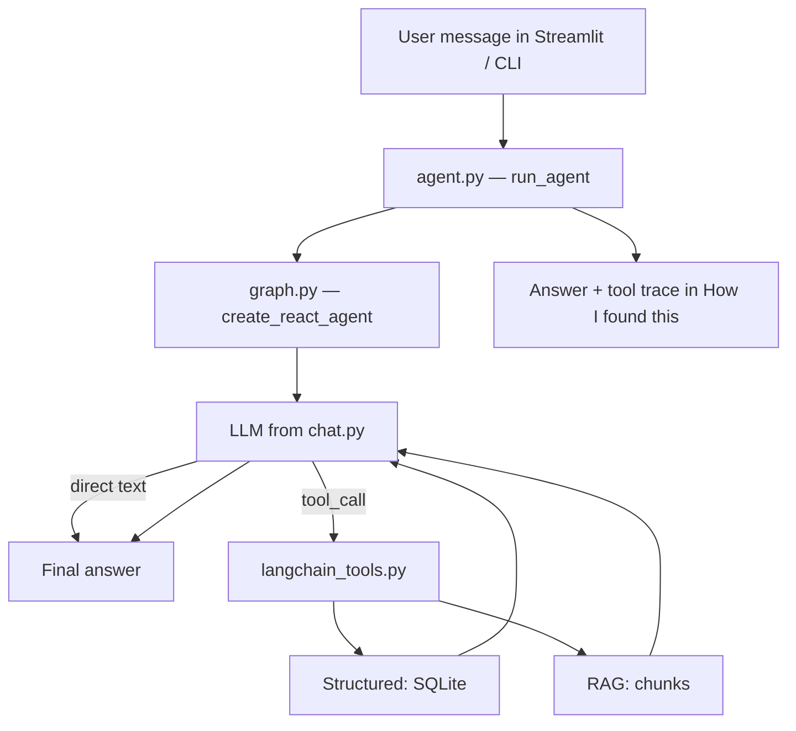
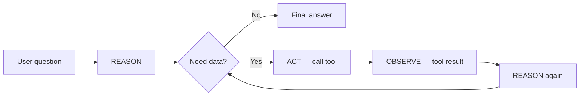
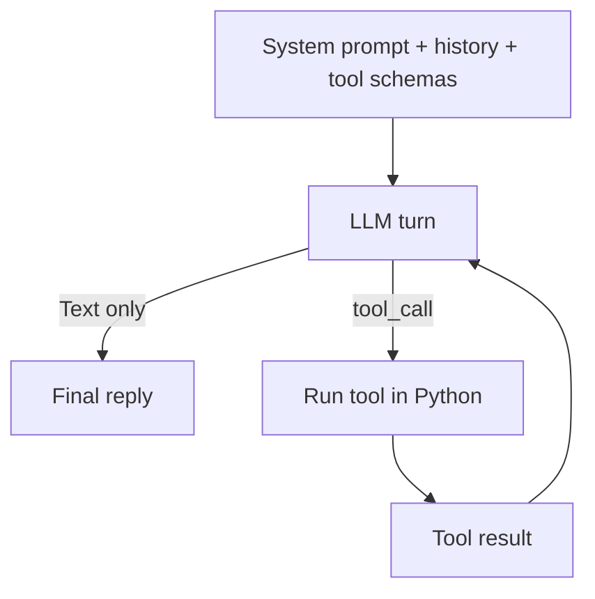
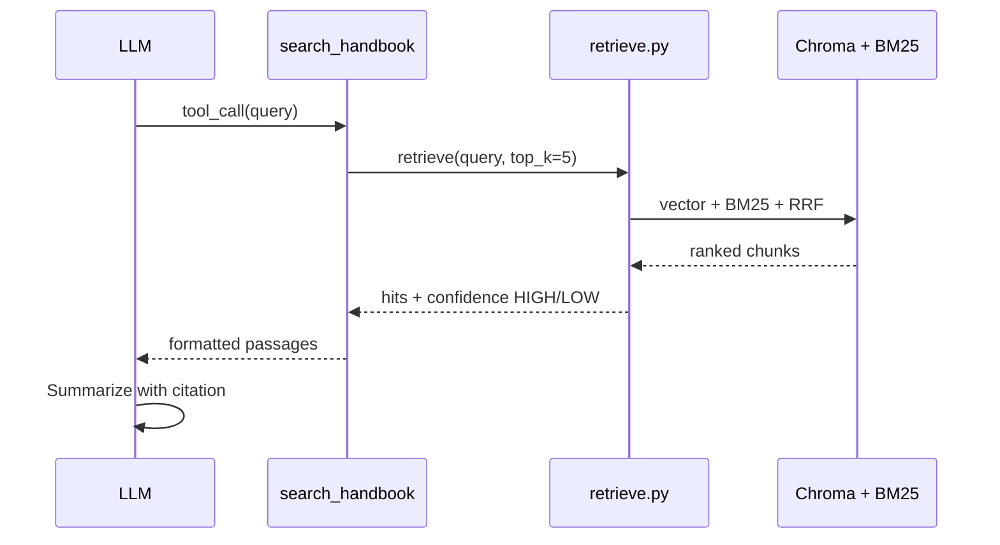

# LLM, LangGraph & tool decisions

> **Purpose:** How UniPath LK chooses an LLM, runs the LangGraph ReAct agent, and decides when to call tools (including handbook chunk search).  
> **Code:** `src/llm/chat.py`, `src/agent/graph.py`, `src/agent/agent.py`, `src/agent/langchain_tools.py`

---

## 1. End-to-end flow



**Key idea:** There is **no Python `if` router** that picks tools from keywords. The **LLM** decides each ReAct step from the system prompt, tool docstrings, and chat history. LangGraph executes tools and loops until the model produces a final answer.

---

## 2. LLM providers

Configured in `src/llm/chat.py` and selected in the Streamlit sidebar (or via `.env`).

| Provider | Model (default) | Best for | Requires |
|----------|-----------------|----------|----------|
| **ollama** | `llama3.2` (`CHAT_MODEL`) | Free local dev | `ollama serve` |
| **openai** | `gpt-4o-mini` (`OPENAI_MODEL`) | Strong tool routing, Sinhala | `OPENAI_API_KEY` |
| **google** | `gemini-2.0-flash` (`GOOGLE_MODEL`) | Cloud alternative | `GOOGLE_API_KEY` |

```python
# src/llm/chat.py — one factory for all providers
get_chat_model(provider)  # temperature=0 for deterministic tool calls
```

**Why temperature 0:** More consistent tool selection and fewer invented numbers.

**Provider impact on routing:** Cloud models (OpenAI, Gemini) usually pick the right tool more reliably than local Ollama `llama3.2`. Wrong tool choice or skipping tools is an **LLM behavior** issue, not a bug in `retrieve.py` or `queries.py`.

**Legacy path:** If LangGraph dependencies are missing, `run_agent(..., use_legacy=True)` falls back to a hand-written JSON tool loop in `src/agent/legacy.py`. The main Streamlit app uses LangGraph by default.

---

## 3. LangGraph ReAct agent

Built in `src/agent/graph.py`:

```python
create_react_agent(
    llm,           # from get_chat_model(provider)
    ALL_TOOLS,     # six @tool functions
    prompt=SystemMessage(content=SYSTEM_PROMPT),
)
```

### What LangGraph does

1. Sends system prompt + conversation + tool schemas to the LLM.
2. If the LLM returns **tool calls**, runs the matching Python functions.
3. Appends tool results as messages and calls the LLM again.
4. Repeats until the LLM returns a **plain text** final answer (no more tools).



**ReAct** = **Re**ason + **Act**. Implemented by LangGraph's prebuilt agent — not a custom loop in this repo.

### Agent caching

`build_agent(provider)` caches one ReAct graph per provider (`ollama`, `openai`, `google`). Switching sidebar provider calls `reset_agent()` so the next message uses the new LLM.

### Message conversion

Streamlit stores `{role, content}` dicts. `to_langchain_messages()` converts them to `HumanMessage` / `AIMessage` before `agent.invoke({"messages": ...})`.

### Orchestration in agent.py

`run_agent()` → `_run_langgraph_agent()` → `run_graph()` → extracts:

- Final answer from last `AIMessage`
- Tool trace via `_extract_tool_calls()` for the **How I found this** expander

---

## 4. System prompt (routing instructions)

Defined in `SYSTEM_PROMPT` in `src/agent/graph.py`. This is the main **behavior contract** for the LLM.

### Conversation rules

- Be warm; handle greetings without calling tools.
- Reply in the user's language (Sinhala, Tamil, English) when summarizing tool output.
- Use earlier messages for context (district, Z-score, course names).
- Ask a short clarifying question when required info is missing.
- Stay on UGC/university admission; redirect off-topic questions.
- Never mention internal tools, RAG, agents, or databases to the user.

### Tool families (from prompt)

| Family | Tools | Data source |
|--------|-------|-------------|
| **Structured** | `get_eligible_courses`, `get_gap_analysis`, `compare_courses`, `find_course` | SQLite |
| **Handbook** | `search_handbook`, `lookup_section` | Chunks / RAG |

### Hard rules

- Never invent Z-scores, cutoffs, or university names — only report tool output.
- If a tool returns `"Found N eligible"`, report that count — do not say none unless the tool says so.
- Handbook answers: cite `(Section X.X, Handbook 2025/26, p.N)`.
- Label structured facts as official catalogue/cutoff data (2024/2025).
- If tools lack information, say you don't have enough information.

---

## 5. Tool schemas (what the LLM reads)

Registered in `src/agent/langchain_tools.py` with `@tool`. LangChain exposes **name**, **description** (docstring), and **parameters** to the model.

| Tool | Docstring summary | Chunk search |
|------|-------------------|--------------|
| `get_eligible_courses(district, z_score, year?)` | List courses/universities at district + Z-score | No |
| `get_gap_analysis(district, z_score, course_code, year?)` | Gap to cutoff for one course | No |
| `compare_courses(course_1, course_2)` | Compare two programmes | No |
| `find_course(name)` | Lookup catalogue by name | No |
| `search_handbook(query)` | Search policy/procedure (SLIATE, appeals, Uni-Code) | **Yes — hybrid RAG** |
| `lookup_section(section_id)` | Fetch section e.g. `1.7` | Section scan only |

**Wiring:** `langchain_tools.py` → `tools_structured.py` / `tools_rag.py` → `queries.py` / `retrieve.py`

Keep docstrings aligned with the system prompt so the LLM can match user intent to the right tool.

---

## 6. Decision making: tools vs no tools

### Who decides?

| Layer | Role |
|-------|------|
| **`graph.py`** | Registers tools + system prompt; runs ReAct |
| **LLM** | Each step: direct answer **or** `tool_call` |
| **LangGraph** | Executes tool, appends result, loops |



### Inputs that steer the LLM

1. **`SYSTEM_PROMPT`** — when to skip tools, which family to use, citation rules.
2. **Tool docstrings** — semantic match between question and tool description.
3. **Conversation history** — prior district, Z-score, course mentions.

### Routing table (expected behavior)

| Situation | Expected behavior |
|-----------|-------------------|
| Greetings, thanks, small talk | **No tools** — direct reply |
| Z-score, eligibility, cutoffs, compare | **Structured tools** → SQLite |
| Policy, SLIATE, Uni-Code, appeals, procedures | **`search_handbook`** or **`lookup_section`** |
| Missing district / Z-score / course | Clarifying question (may skip tools first) |
| Off-topic | Polite redirect — no tools |
| Tool output insufficient | Admit uncertainty |

### Example messages

| User message | Expected tool(s) | Chunk search? |
|--------------|------------------|---------------|
| “Hi” | None | No |
| “Z-score 2.04 Colombo, what courses?” | `get_eligible_courses` | No |
| “Can I apply if I registered at SLIATE?” | `search_handbook` | **Yes** |
| “Compare Physical Science vs Computer Science” | `compare_courses` | No |
| “What does section 1.7 say?” | `lookup_section` or `search_handbook` | Lookup or hybrid |
| “Gap to Medicine in Colombo, Z 2.1” | `get_gap_analysis` | No |

The LLM may call **multiple tools** in one turn, then merge results in the final reply.

---

## 7. When handbook chunks are searched

Chunk search is **not** automatic on every message. It runs only when the LLM calls a RAG tool.

| Tool | Mechanism |
|------|-----------|
| **`search_handbook(query)`** | `tools_rag.py` → `retrieve()` — vector + BM25 + RRF → top K chunks |
| **`lookup_section("1.7")`** | Scans chunks JSONL by section id — **no** vector/BM25 |
| **Structured tools** | SQLite only — **no** chunk access |

### search_handbook path



Tool output includes `Retrieval confidence: HIGH` or `LOW`. On LOW, the prompt tells the LLM not to invent handbook text.

### lookup_section path

```
LLM → lookup_section("1.7") → scan chunks JSONL → return up to 5 matching blocks
```

### Not used by the main agent

`answer_question()` in `src/rag/answer.py` is a standalone RAG helper. The Streamlit agent uses **tools + one ReAct LLM** instead — the model calls `search_handbook`, reads passages, and writes the answer itself.

---

## 8. What the codebase does *not* do

| Not implemented | Implication |
|-----------------|-------------|
| Keyword router (`if "SLIATE" in query`) | Routing is LLM judgment only |
| Auto-RAG on every message | RAG only when RAG tools are called |
| User-selectable “RAG mode” in UI | Mode is implicit from the question |
| Automatic retry on LOW confidence | LLM should admit uncertainty per prompt |

---

## 9. Observing decisions in the UI

Streamlit (`app.py`) shows tool usage in **How I found this**:

| What you see | Meaning |
|--------------|---------|
| `search_handbook` | Hybrid chunk search ran |
| Only structured tools | SQLite only; no retrieval |
| No tools | Direct LLM reply (greetings, clarifications) |

---

## 10. File map

| File | Responsibility |
|------|----------------|
| `src/llm/chat.py` | Provider factory (`ollama` / `openai` / `google`) |
| `src/agent/graph.py` | LangGraph ReAct agent, `SYSTEM_PROMPT`, invoke |
| `src/agent/agent.py` | `run_agent()`, tool trace extraction, errors |
| `src/agent/langchain_tools.py` | `@tool` wrappers exposed to the LLM |
| `src/agent/tools_structured.py` | SQLite tool implementations |
| `src/agent/tools_rag.py` | Handbook search + section lookup |
| `src/agent/legacy.py` | Fallback JSON agent (optional) |
| `app.py` | Chat UI + tool trace expander |

---

## 11. One-line summary

**The LLM in LangGraph ReAct chooses tools each step from the system prompt and tool docstrings; handbook chunks are searched only when it calls `search_handbook` (hybrid RRF) or `lookup_section` (section scan) — not on every message.**

---

## 12. Related docs

- [PROJECT_GUIDE.md](PROJECT_GUIDE.md) — full architecture and data pipeline
- [DATA_AND_CHUNKING.md](DATA_AND_CHUNKING.md) — chunking, indexing, hybrid retrieval details
