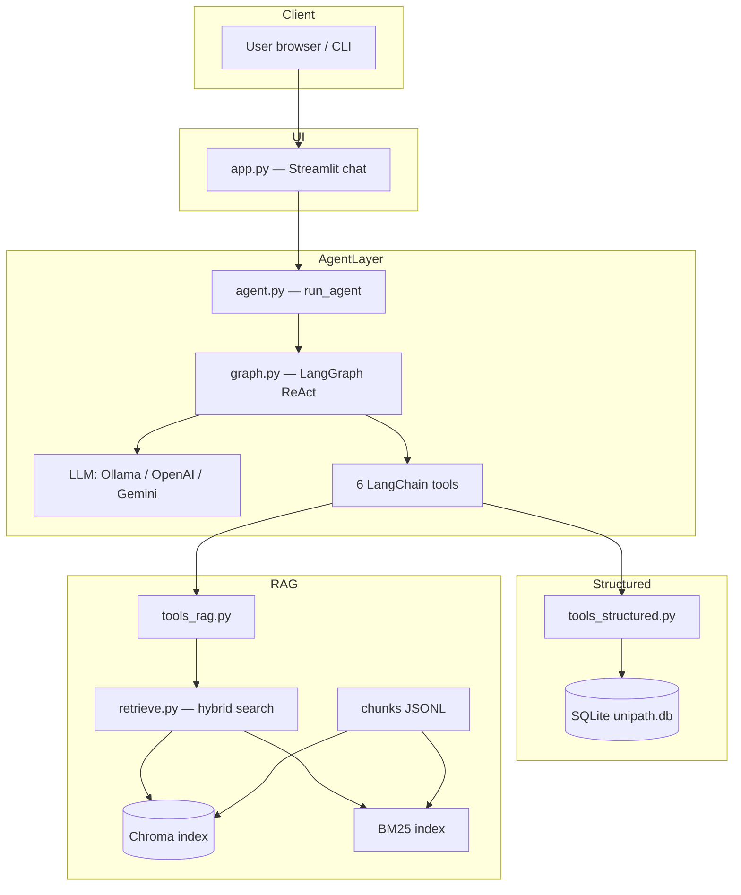
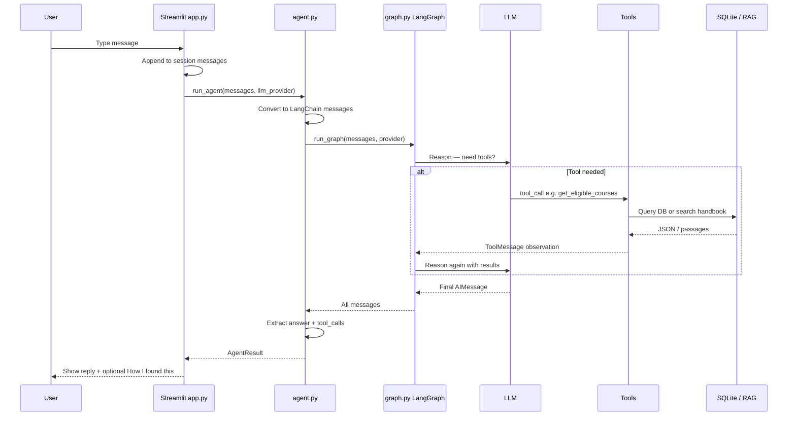
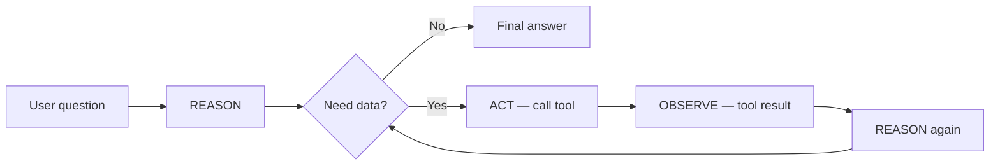
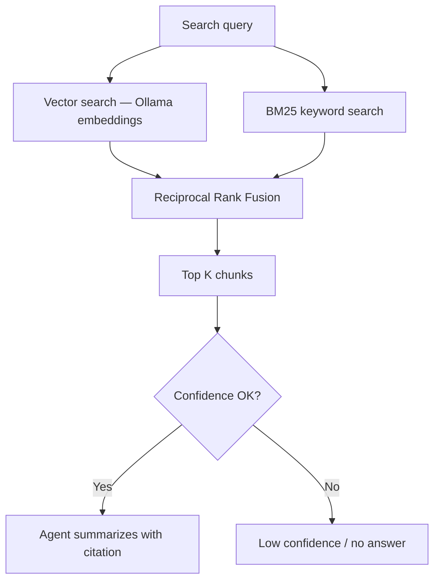
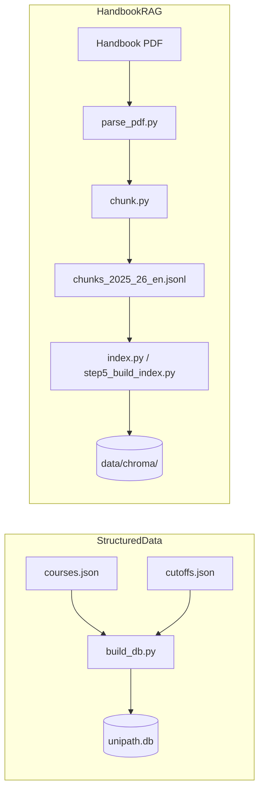
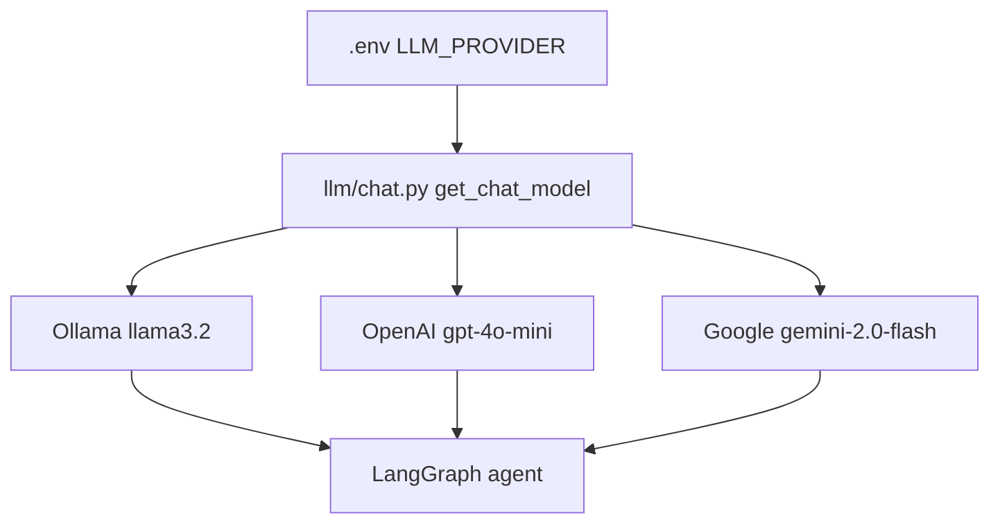
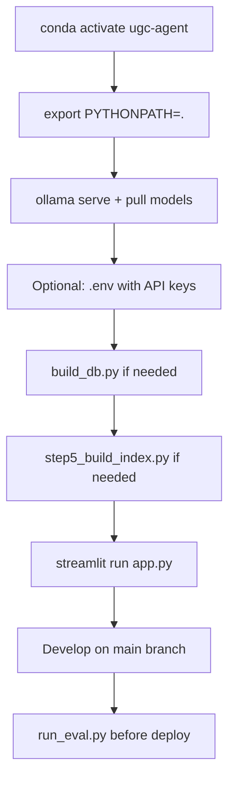

# UniPath LK — Project Guide

> **Purpose:** Single reference for architecture, workflows, and project decisions.  
> **Repo:** [github.com/Jayasanka-madhawa/UniPath-LK](https://github.com/Jayasanka-madhawa/UniPath-LK)  
> **Status:** Portfolio v1 — educational demo, not official UGC advice.

---

## 1. What this project is

**UniPath LK** is a conversational assistant for **UGC Sri Lanka university admission**. It combines:

| Layer | Source | Used for |
|-------|--------|----------|
| **Structured data** | SQLite (`courses`, `cutoffs`) | Z-scores, eligibility, course comparison |
| **Handbook RAG** | PDF → chunks → Chroma + BM25 | Policy, SLIATE, Uni-Code, procedures |
| **Agent** | LangGraph ReAct | Picks tools automatically from user message |

**Design rule:** Numbers come from SQLite only. Policy text comes from the handbook only. The agent must not invent cutoffs or rules.

---

## 2. High-level architecture



---

## 3. Request workflow (one chat turn)



### Steps in plain language

1. User sends message in Streamlit.
2. Full conversation history goes to `run_agent()`.
3. LangGraph ReAct loop: think → maybe call tool → read result → answer.
4. Final text shown in chat; tool trace shown in expander.

---

## 4. ReAct loop (agent brain)



Implemented by `create_react_agent()` in `graph.py`. The LLM decides tool vs no-tool each step — there is no keyword router in Python.

**Full detail:** [LLM_AND_AGENT.md](LLM_AND_AGENT.md) — providers, LangGraph setup, system prompt, tool routing, when chunk search runs, UI trace.

---

## 5. Agent tools (6)

| Tool | Layer | Purpose | Chunk search |
|------|-------|---------|--------------|
| `get_eligible_courses` | Structured | Courses/universities at district + Z-score | No |
| `get_gap_analysis` | Structured | Distance from cutoff for one course | No |
| `compare_courses` | Structured | Compare two programmes | No |
| `find_course` | Structured | Lookup by name | No |
| `search_handbook` | RAG | Hybrid search over handbook | **Yes** (vector + BM25 + RRF) |
| `lookup_section` | RAG | Fetch section by number e.g. 1.7 | Section scan only |

**Wiring:** `langchain_tools.py` → `tools_structured.py` / `tools_rag.py` → `queries.py` / `retrieve.py`

See [LLM_AND_AGENT.md](LLM_AND_AGENT.md) for how the LLM chooses these tools and when chunk search runs.

---

## 6. RAG workflow (handbook search)



**Files:** `retrieve.py`, `bm25_index.py`, `tools_rag.py`  
**Index build:** `step3_make_chunks.py` → `step5_build_index.py`  
**Embeddings (current):** Ollama `nomic-embed-text`  
**Embeddings (planned for deploy):** OpenAI `text-embedding-3-small`

---

## 7. Data pipeline (offline / build time)



### What is committed vs built locally

| Path | In Git? | Notes |
|------|---------|-------|
| `courses.json`, `cutoffs.json` | Yes | Source data |
| `chunks_2025_26_en.jsonl` | Yes | Processed handbook |
| `unipath.db` | No | Run `build_db.py` |
| `data/chroma/` | No | Run `step5_build_index.py` |
| `.env` | No | API keys |

---

## 8. LLM providers



| Provider | Chat | Embeddings | Best for |
|----------|------|------------|----------|
| Ollama | Yes | Yes (`nomic-embed-text`) | Local free dev |
| OpenAI | Yes | Planned replacement | Deploy + Sinhala |
| Google | Yes | No (today) | Alternative cloud chat |

**Note:** Embeddings are separate from chat. Chat uses the Chat API; search uses embedding vectors.

---

## 9. Module map

```
ugc-agent/
├── app.py                 # Streamlit UI, provider switch, chat history
├── documentation/
│   ├── PROJECT_GUIDE.md   # Architecture, workflows, diagrams
│   └── DATA_AND_CHUNKING.md # Data sources, chunking, RAG
├── docs/                  # UGC handbook PDFs (source files)
├── src/
│   ├── agent/
│   │   ├── agent.py       # Entry: run_agent(), error handling
│   │   ├── graph.py       # LangGraph ReAct + system prompt
│   │   ├── langchain_tools.py
│   │   ├── tools_structured.py
│   │   ├── tools_rag.py
│   │   └── legacy.py      # Old Ollama JSON agent (fallback)
│   ├── db/queries.py      # SQLite queries
│   ├── rag/
│   │   ├── retrieve.py    # Hybrid retrieval
│   │   ├── bm25_index.py
│   │   └── answer.py      # Standalone RAG Q&A
│   ├── llm/chat.py        # LLM factory
│   └── config.py          # Paths, .env, constants
├── scripts/
│   ├── build_db.py
│   ├── step5_build_index.py
│   ├── run_eval.py
│   └── step8_agent_ask.py
├── eval/                  # Golden QA tests
└── notebooks/explore_data.ipynb
```

### Key file responsibilities

| File | Role |
|------|------|
| `app.py` | Streamlit chat UI, provider switch, conversation history |
| `src/agent/agent.py` | Orchestrator; LangGraph invoke + error handling |
| `src/agent/graph.py` | ReAct agent, system prompt, per-provider cache |
| `src/llm/chat.py` | LLM factory: ollama \| openai \| google |
| `src/db/queries.py` | SQLite: eligible, gap, compare, find |
| `src/rag/retrieve.py` | Chroma vector + BM25 + RRF fusion |
| `src/config.py` | Paths, .env loader, retrieval constants |

---

## 10. Local development workflow



### Commands cheat sheet

```bash
conda activate ugc-agent
cd ugc-agent
export PYTHONPATH=.

python scripts/build_db.py
python scripts/step5_build_index.py
streamlit run app.py
python scripts/run_eval.py
```

---

## 11. Git / deploy workflow (planned)

```mermaid
gitGraph
  commit id: "dev work"
  branch main
  checkout main
  commit id: "feature A"
  commit id: "feature B"
  branch deploy
  checkout deploy
  commit id: "stable demo"
  checkout main
  commit id: "continue dev"
```

| Branch | Purpose |
|--------|---------|
| `main` | Daily development |
| `deploy` | Stable version for live demo |

### Planned deploy stack

- **Hosting:** Streamlit Community Cloud (free)
- **Chat:** OpenAI `gpt-4o-mini`
- **Embeddings:** OpenAI `text-embedding-3-small` (replace Ollama for cloud)
- **Cost (no traffic):** ~$0–2 for 3 months

### Deploy checklist

```
[ ] eval passes on deploy branch
[ ] OPENAI_API_KEY set in host secrets (not in git)
[ ] build_db.py + step5_build_index.py run on deploy
[ ] Demo URL in README
[ ] OpenAI billing limit set (e.g. $5/mo)
```

---

## 12. Known limitations

- Cutoffs: **21 course codes**, not all 101 catalogue entries
- Academic year: **2024/2025** cutoffs in 2025/26 handbook context
- ~**15 incomplete** catalogue rows (Arts, Engineering, etc.)
- **Medicine** in cutoffs but missing from course catalogue
- Handbook RAG: **English only** today
- Sinhala: LLM can reply in Sinhala, but RAG/search works best in English
- Not connected to live UGC systems
- Requires Ollama locally today (for embeddings); planned change for cloud deploy

---

## 13. Roadmap

| Priority | Task |
|----------|------|
| P0 | Clean repo, eval green, `deploy` branch |
| P0 | OpenAI embeddings → drop Ollama requirement for deploy |
| P0 | Streamlit Cloud + README demo link |
| P1 | Fix incomplete `courses.json` / Medicine entry |
| P1 | Sinhala query translation before RAG |
| P2 | Sinhala district/course aliases |
| P2 | Eval set for Sinhala (`eval/golden_qa_sinhala.json`) |
| P3 | CI on `deploy` branch, Docker optional |

---

## 14. Decision log

| Date | Decision | Reason |
|------|----------|--------|
| v1 | LangGraph ReAct over legacy JSON agent | Better tool calling, multi-provider |
| v1 | Hybrid RAG Chroma + BM25 + RRF | Better handbook recall |
| v1 | SQLite for all numeric facts | No hallucinated Z-scores |
| v1 | Three LLM providers (Ollama, OpenAI, Google) | Local free dev + cloud quality |
| Planned | OpenAI embeddings for deploy | Free Streamlit Cloud, no Ollama on server |
| Planned | `main` / `deploy` branches | Dev continues while demo stays stable |

---

## 15. Glossary

| Term | Meaning |
|------|---------|
| **ReAct** | Reason + Act — agent loop with tools |
| **Tool routing** | LLM choice of tool vs direct reply — see [LLM_AND_AGENT.md](LLM_AND_AGENT.md) |
| **RAG** | Retrieval-Augmented Generation — search then answer |
| **RRF** | Reciprocal Rank Fusion — merge vector + keyword ranks |
| **Z-score** | District rank used for university admission cutoffs |
| **Uni-Code** | Preference code for course/university choices |
| **Chunk** | Small handbook text segment stored for search |
| **BM25** | Keyword-based search ranking |
| **Chroma** | Vector database for embedding search |

---

## 16. Related docs

- [LLM_AND_AGENT.md](LLM_AND_AGENT.md) — LLM providers, LangGraph ReAct, tool routing, chunk search triggers
- [DATA_AND_CHUNKING.md](DATA_AND_CHUNKING.md) — data sources, chunking strategy, indexing, retrieval

---

## 17. Disclaimer

Educational portfolio project only. Not official UGC advice. Always verify with [UGC Sri Lanka](https://www.ugc.ac.lk/).


